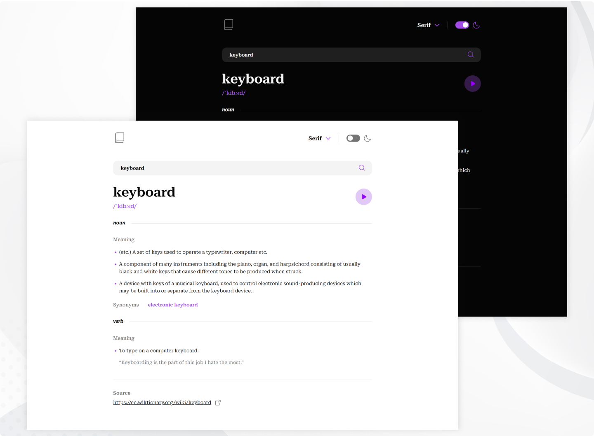

# Frontend Mentor - Dictionary web app

### The challenge

Users should be able to:

- Search for words using the input field
- See the Free Dictionary API's response for the searched word
- See a form validation message when trying to submit a blank form
- Play the audio file for a word when it's available
- Switch between serif, sans serif, and monospace fonts
- Switch between light and dark themes
- View the optimal layout for the interface depending on their device's screen size
- See hover and focus states for all interactive elements on the page
- Bonus: Have the correct color scheme chosen for them based on their computer preferences.

### Built with

- React (Hooks, Context API)
- React Query
- Axios
- [Dictionary API](https://dictionaryapi.dev/)
- CSS

### Screenshot

### Links

- Solution URL: [GitHub](https://github.com/DorottyaB/dictionary-web-app)
- Live Site URL: [on Netlify](https://dictionary-dorottyab.netlify.app/)

## Author

- Website - [Dorottya](https://github.com/DorottyaB)
